# DivKit Flutter SDK — Complete Architecture Reference
> **Server-Driven UI (SDUI) from Low-Level Rendering Internals to Business Logic Flows**
>
> Covers: Twin Tree Architecture · Variable Reactivity · Expression AST Engine · Layout Pipeline · State Transitions · Action Routing · Network Sync · Rust Clean Architecture Backend

---

## Table of Contents

1. [System Overview — SDUI Mental Model](#1-system-overview--sdui-mental-model)
2. [Twin Tree Architecture — Data vs Visual](#2-twin-tree-architecture--data-vs-visual)
3. [JSON-to-DTO Parsing Pipeline](#3-json-to-dto-parsing-pipeline)
4. [DivContext — Dependency Injection Graph](#4-divcontext--dependency-injection-graph)
5. [Variable Storage and Granular Reactivity](#5-variable-storage-and-granular-reactivity)
6. [Expression Engine — AST Evaluation](#6-expression-engine--ast-evaluation)
7. [State Management and Visual Branch Transitions](#7-state-management-and-visual-branch-transitions)
8. [DivLayout — Custom RenderBox Pipeline](#8-divlayout--custom-renderbox-pipeline)
9. [Hardware Triggers and Action Routing](#9-hardware-triggers-and-action-routing)
10. [Network Synchronization and div-patch](#10-network-synchronization-and-div-patch)
11. [Rust Backend — Clean Architecture Layers](#11-rust-backend--clean-architecture-layers)
12. [End-to-End Business Logic Flow — Add to Cart](#12-end-to-end-business-logic-flow--add-to-cart)
13. [End-to-End Business Logic Flow — Page Navigation](#13-end-to-end-business-logic-flow--page-navigation)
14. [End-to-End Business Logic Flow — Live Inventory Sync](#14-end-to-end-business-logic-flow--live-inventory-sync)
15. [Performance Profiles and Frame Budget](#15-performance-profiles-and-frame-budget)
16. [Component Dependency Map](#16-component-dependency-map)

---

## 1. System Overview — SDUI Mental Model

Server-Driven UI (SDUI) inverts the conventional mobile architecture: instead of the client binary defining views at compile time, the **server emits declarative layout descriptors** that the client renders at runtime. DivKit is a production-grade SDUI framework developed by Yandex, enabling instantaneous UI deployments, granular A/B testing, and dynamic personalisation without App Store review cycles.

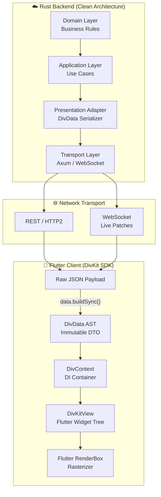

**Core Invariants:**
- The server is the **single source of truth** for layout structure, variable values, and action intents.
- The client is a **dumb renderer** — it never defines layout logic, only evaluates and paints it.
- All dynamic expressions (`@{var}`) are resolved **synchronously on the client** from a pre-built AST.
- The server never tracks the client's widget tree state; it responds to URI actions with new JSON.

---

## 2. Twin Tree Architecture — Data vs Visual

DivKit separates concern into two **parallel but decoupled trees** to guarantee that JSON parsing never blocks the Flutter UI thread:

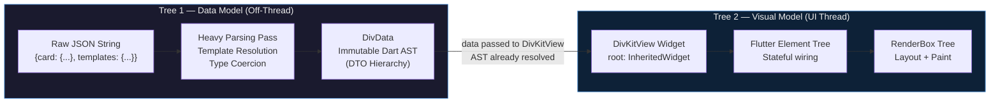

**Why two trees?**

| Concern | Tree 1 (DivData AST) | Tree 2 (Flutter Visual) |
|---|---|---|
| **Thread** | Background Isolate or Pre-frame | Main UI Thread |
| **Mutability** | Immutable DTO — frozen after build | Mutable Element/RenderObject |
| **Cost** | JSON deserialization + template merge (expensive) | Widget inflation + layout (cheap — AST already resolved) |
| **Lifetime** | Survives across frame rebuilds | Rebuilt on state transitions |
| **Key API** | `data.build()` / `data.buildSync()` | `DivKitView(data: data)` |

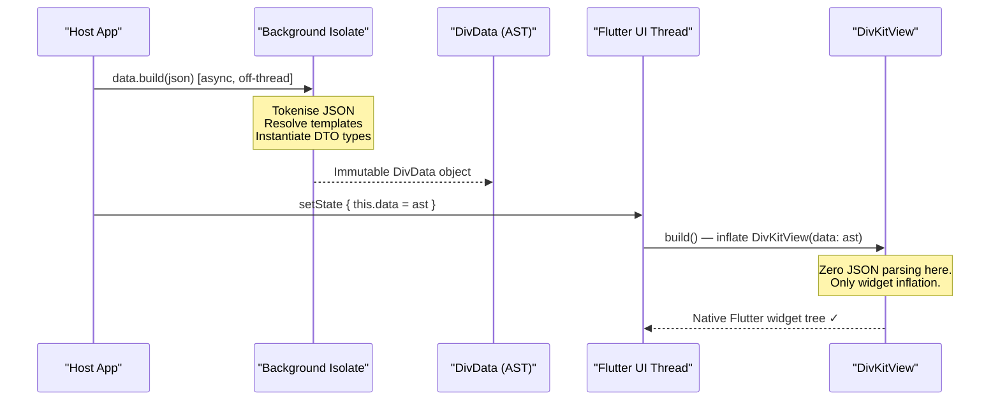

---

## 3. JSON-to-DTO Parsing Pipeline

This is the detailed low-level flow of how a raw JSON payload becomes a strongly typed Dart AST:

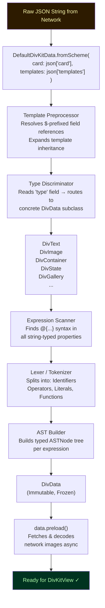

**Key packages involved:**
- `petitparser` — Grammar-based expression parser (PEG grammar)
- `rxdart` — Reactive streams for variable change propagation
- `visibility_detector` — Viewport intersection tracking
- `cached_network_image` — Async image decoding pipeline

---

## 4. DivContext — Dependency Injection Graph

`DivContext` is the **InheritedWidget-based service locator** that roots the entire DivKit component hierarchy. It provides four singleton managers to every descendant widget without prop-drilling:

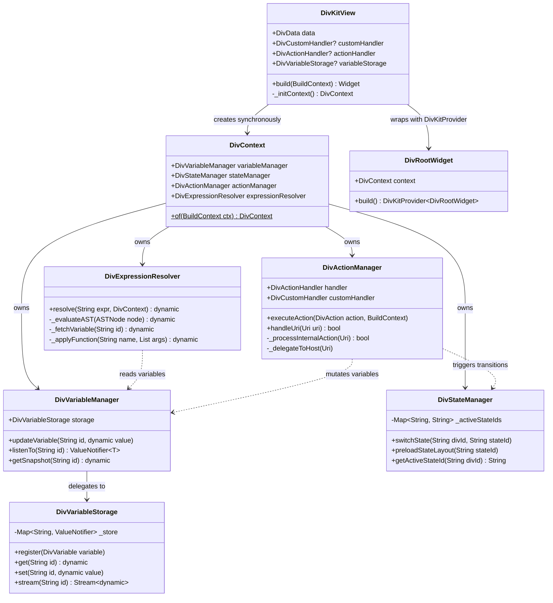

**Initialisation sequence (v0.6.0+ — fully synchronous):**

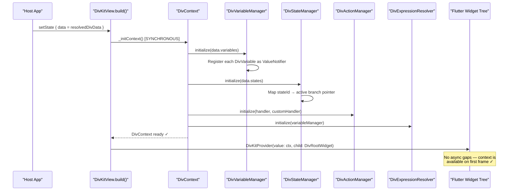

---

## 5. Variable Storage and Granular Reactivity

DivKit avoids `setState()` at the root level. Instead, individual widgets subscribe to specific `ValueNotifier`s, ensuring **only the exact changed widget repaints**:

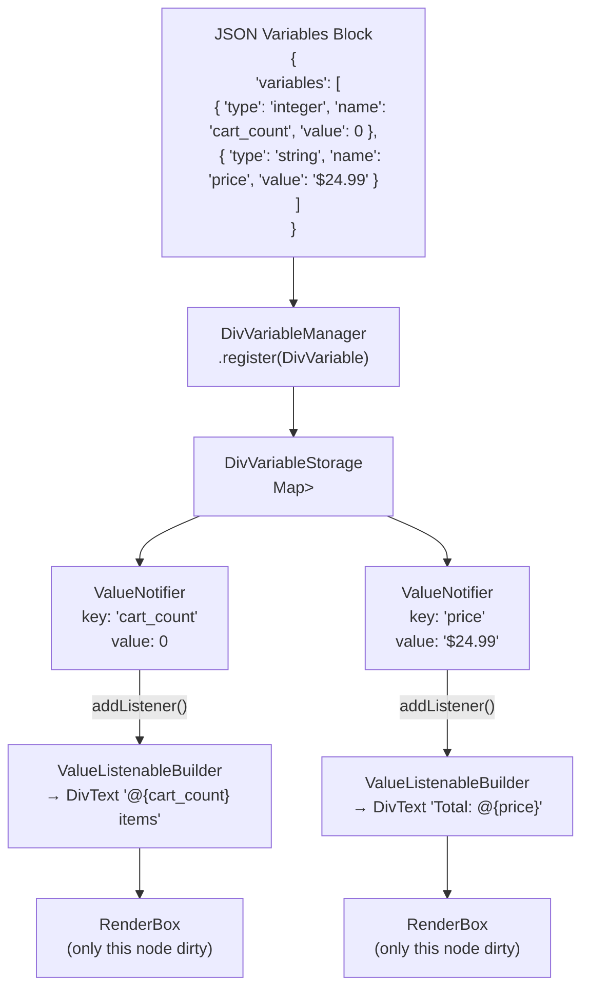

**Reactive mutation sequence — user taps "Add to Cart":**

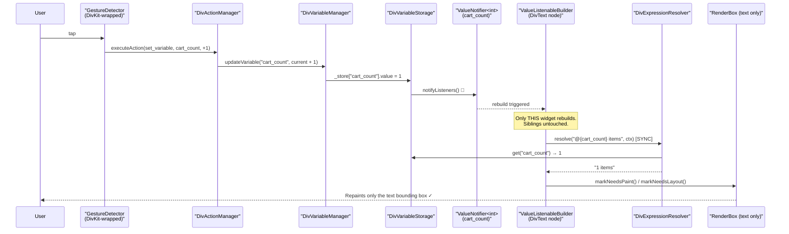

**Performance comparison — naive vs DivKit reactivity:**

| Approach | Widgets Rebuilt | Frame Cost | Risk |
|---|---|---|---|
| `root.setState()` | All widgets in tree (N) | O(N) — can miss 16ms budget | Jank, dropped frames |
| `InheritedWidget` + `context.watch` | All dependents (K) | O(K) | Still broad |
| **DivKit `ValueNotifier` per variable** | **Only bound widgets (1..M)** | **O(1) per change** | **None — guaranteed 60fps** |

---

## 6. Expression Engine — AST Evaluation

The DivKit expression engine processes `@{...}` strings into a hierarchical AST evaluated entirely **synchronously** on the Dart main thread:

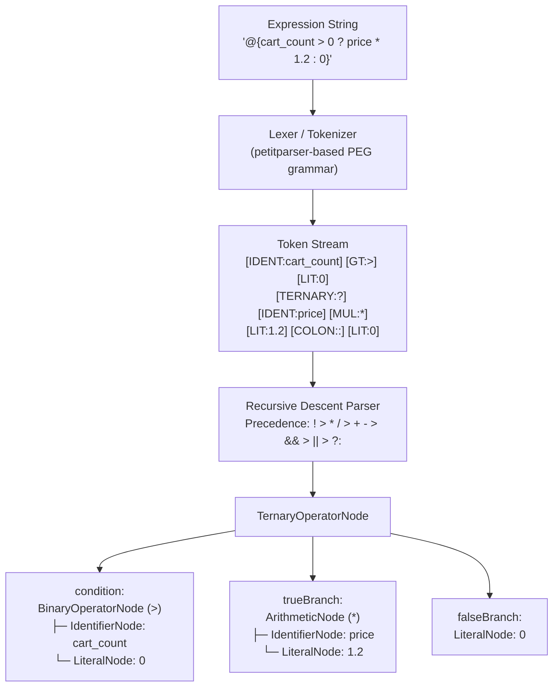

**AST Node resolution mechanics:**

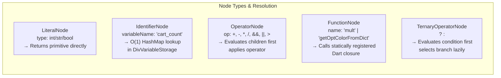

**Why synchronous evaluation matters:**

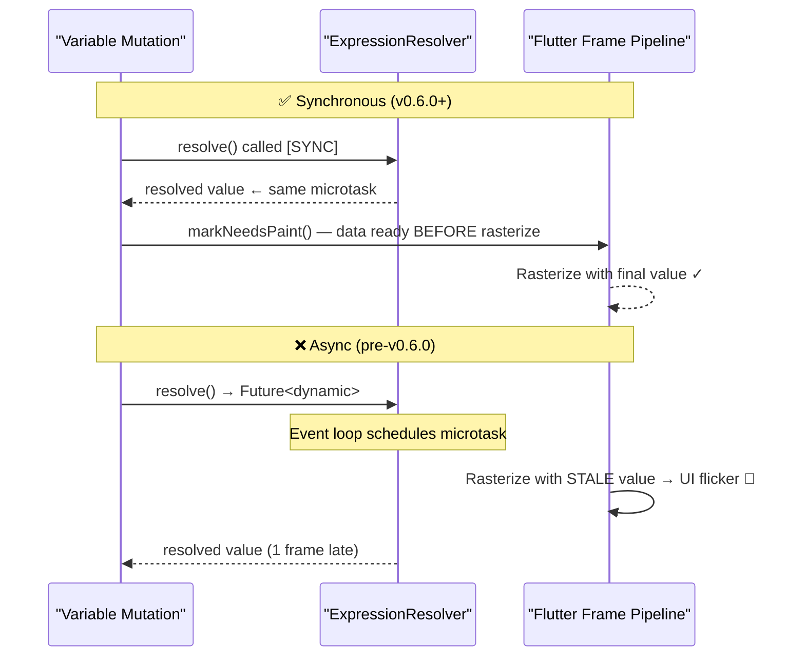

**Operator precedence table:**

| Precedence | Operators | Example |
|---|---|---|
| 1 (highest) | `!` (logical NOT) | `!is_logged_in` |
| 2 | `*`, `/`, `%` | `price * tax_rate` |
| 3 | `+`, `-` | `base + surcharge` |
| 4 | `<`, `>`, `<=`, `>=` | `count > 0` |
| 5 | `==`, `!=` | `status == 'active'` |
| 6 | `&&` | `in_stock && has_price` |
| 7 | `\|\|` | `is_member \|\| is_admin` |
| 8 (lowest) | `? :` (ternary) | `in_stock ? price : 'sold_out'` |

---

## 7. State Management and Visual Branch Transitions

`div-state` enables **localized structural UI swaps** — replacing entire subtrees (e.g., skeleton → loaded content) without rebuilding the root:

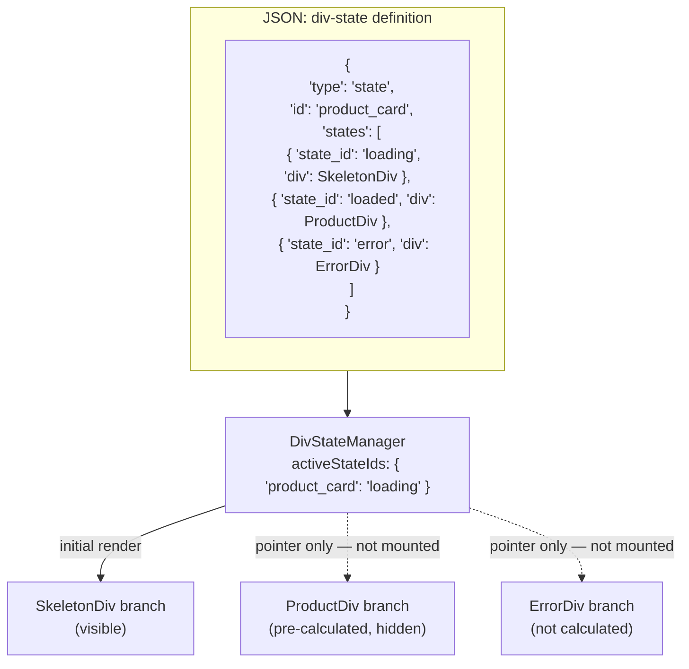

**State transition lifecycle — Skeleton → Loaded:**

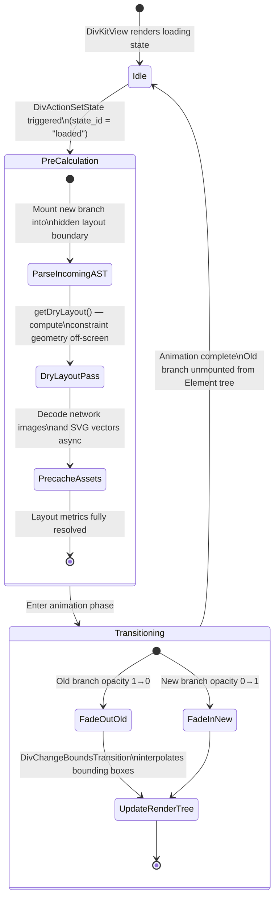

**DivStateManager mutation sequence:**

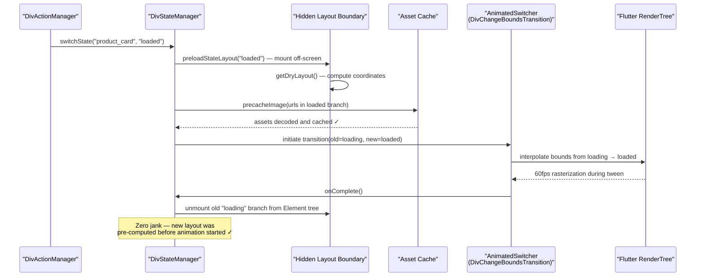

---

## 8. DivLayout — Custom RenderBox Pipeline

DivKit bypasses Flutter's standard Flex layout system entirely, implementing a **proprietary multi-pass layout algorithm** via `MultiChildRenderObjectWidget` and `MultiChildLayoutDelegate`:

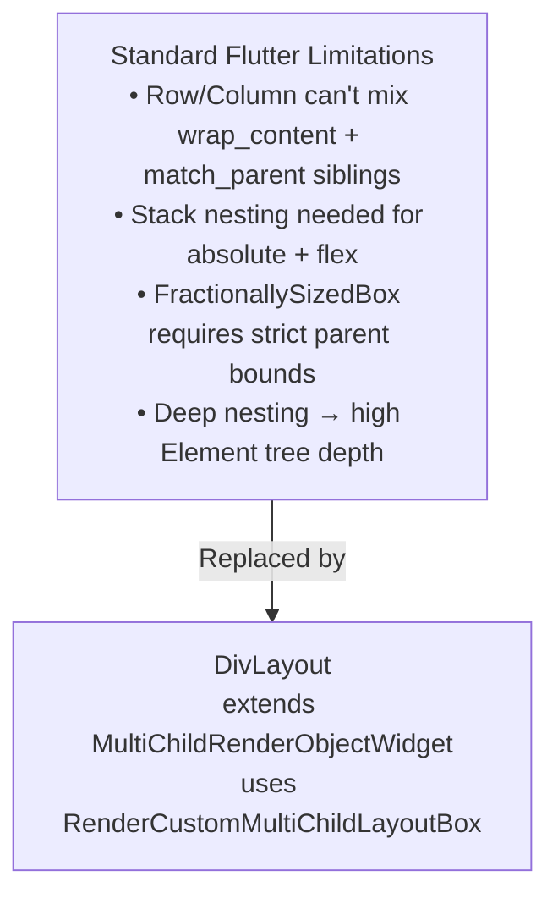

**Custom layout pass — detailed multi-pass algorithm:**

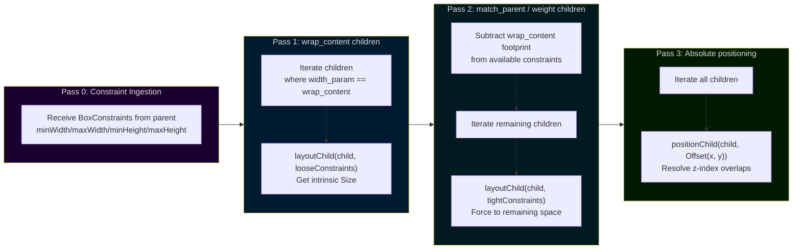

**Layout complexity comparison:**

| Requirement | Standard Flutter | DivKit DivLayout |
|---|---|---|
| `wrap_content` + `match_parent` siblings | Impossible without Heavy workarounds | Pass 1 measures wrap, Pass 2 fills remainder |
| Absolute + Flex on same layer | `Stack(children: [Column(...), Positioned(...)])` — deep nesting | Single `RenderCustomMultiChildLayoutBox` unified pass |
| Percentage sizing (`weight`) | `FractionallySizedBox` — needs strict parent bounds | `DivLayoutParam` resolves `%` to logical pixels during Pass 2 |
| Column span in scrolling list | Requires custom `SliverGridDelegate` | Native `column_span` property in AST, resolved in positioning pass |
| Element tree depth | O(N × nesting_level) | O(N) — single `RenderObject` per logical card |

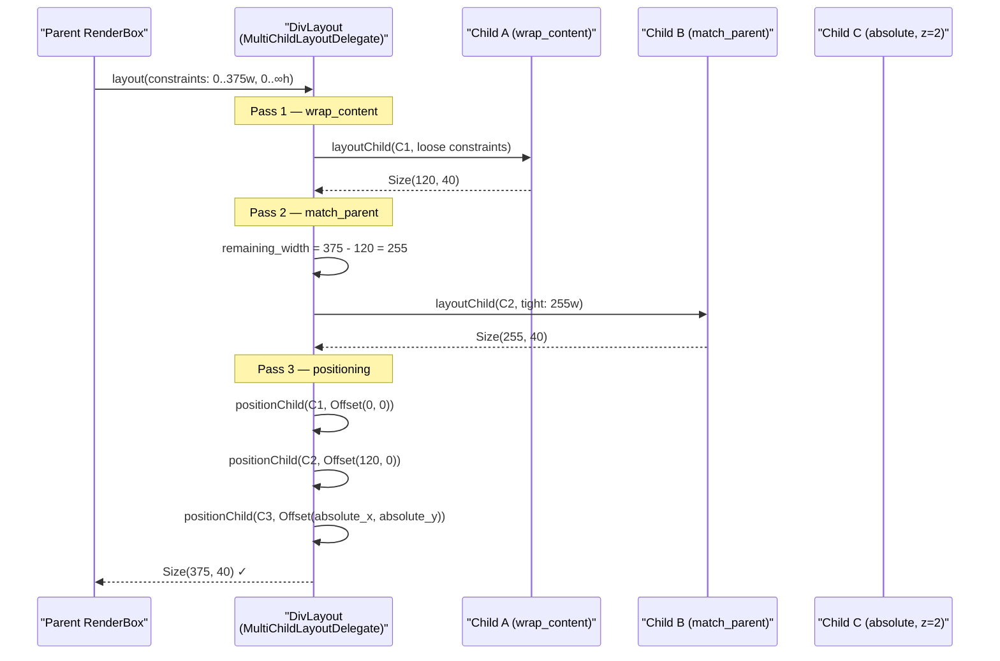

---

## 9. Hardware Triggers and Action Routing

DivKit intercepts all user interactions through a unified action pipeline and routes them via URI schemes:

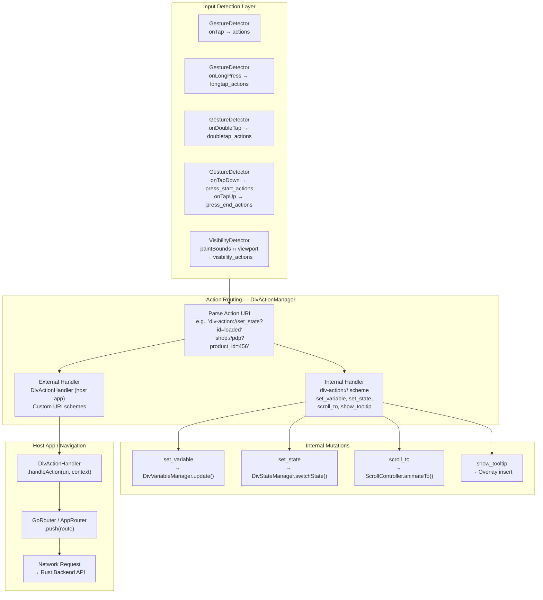

**Visibility action — analytics impression tracking:**

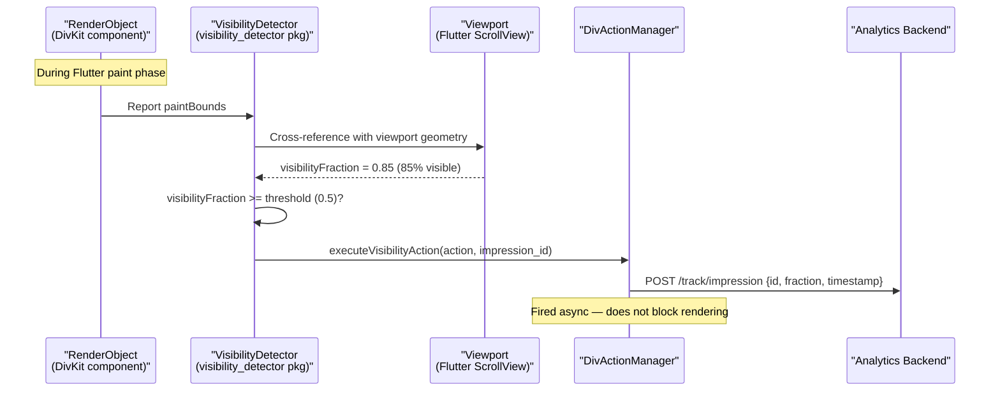

**URI action routing — full flow:**

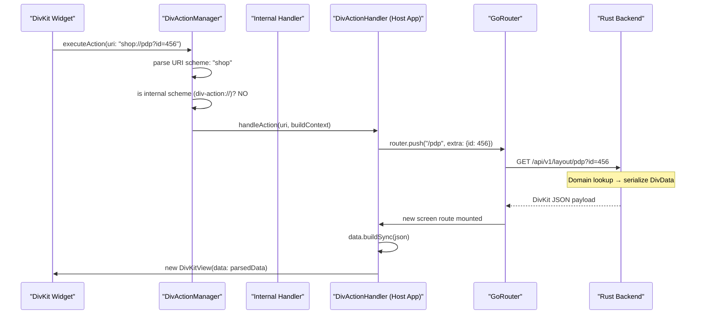

---

## 10. Network Synchronization and div-patch

For live data updates (prices, inventory) without full layout reloads, DivKit uses `div-patch` — a surgical AST splice protocol:

```mermaid
flowchart TD
    subgraph PATCH_PAYLOAD["div-patch JSON Payload (from Rust via WebSocket)"]
        P["{<br/>  'patch': {<br/>    'mode': 'transactional',<br/>    'changes': [<br/>      {<br/>        'id': 'price_display',<br/>        'items': [ { new DivText AST node } ]<br/>      }<br/>    ]<br/>  }<br/>}"]
    end

    subgraph MODES["Mode Semantics"]
        TRX["transactional:<br/>ACID-like — ALL changes succeed<br/>or NONE applied"]
        PART["partial:<br/>Apply valid changes,<br/>log & skip invalid ones"]
    end

    subgraph CLIENT_APPLY["Client: DivStateManager — Patch Application"]
        TRAVERSE["Traverse DivData AST<br/>Find node where id == 'price_display'"]
        IMMUT["Cannot mutate — AST is immutable!<br/>Must use structural sharing"]
        SHARE["Structural Sharing (copyWith)<br/>New root → ... → new target node<br/>Unchanged branches → same memory ref"]
        SPLICE["Splice: replace old node<br/>with parsed patch node"]
    end

    subgraph FLUTTER_DIFF["Flutter Element Diffing"]
        NOTIFY["DivKitView notified of new DivData"]
        DIFF["Element tree diffs new vs old AST"]
        REUSE["Unchanged Elements → same RenderObject<br/>Zero layout cost"]
        DIRTY["Changed Element (price_display)<br/>→ markNeedsLayout()"]
    end

    PATCH_PAYLOAD --> MODES
    MODES --> CLIENT_APPLY
    CLIENT_APPLY --> FLUTTER_DIFF
```

**div-patch structural sharing — immutable update pattern:**

```mermaid
flowchart LR
    subgraph OLD["Old DivData AST"]
        O_ROOT["root"] --> O_CARD["card"]
        O_CARD --> O_HEADER["header (unchanged)"]
        O_CARD --> O_PRICE["price_display<br/>text: '$24.99'"]
        O_CARD --> O_FOOTER["footer (unchanged)"]
    end

    subgraph NEW["New DivData AST (after patch)"]
        N_ROOT["root (new)"] --> N_CARD["card (new)"]
        N_CARD --> O_HEADER
        N_CARD --> N_PRICE["price_display (new)<br/>text: '$19.99' 🔴 SALE"]
        N_CARD --> O_FOOTER
        style N_ROOT fill:#003300,color:#afa
        style N_CARD fill:#003300,color:#afa
        style N_PRICE fill:#003300,color:#afa
    end

    O_HEADER -.->|"shared reference<br/>(same memory)"| N_CARD
    O_FOOTER -.->|"shared reference<br/>(same memory)"| N_CARD
```

**WebSocket live patch sequence:**

```mermaid
sequenceDiagram
    participant WS as "WebSocket<br/>(Rust → Flutter)"
    participant Parser as "JSON Parser"
    participant SM as "DivStateManager"
    participant AST as "DivData AST"
    participant View as "DivKitView"
    participant ETree as "Element Tree"

    WS->>Parser: div-patch JSON frame
    Parser->>SM: applyPatch(changes, mode=transactional)
    SM->>AST: traverse to target node id

    alt Transactional Mode
        SM->>SM: Validate ALL changes first
        SM->>AST: Apply structural sharing → new DivData
    else Partial Mode
        SM->>AST: Apply valid changes, skip invalid
    end

    SM->>View: notifyRootChanged(newDivData)
    View->>ETree: build() — diff new vs old AST
    ETree->>ETree: Reuse Elements for unchanged nodes
    ETree->>ETree: markNeedsBuild() only on changed element
    Note over ETree: Only price_display rerenders ✓
```

---

## 11. Rust Backend — Clean Architecture Layers

The Rust backend must act as a **deterministic UI compiler**, transforming domain aggregates into DivKit-compliant JSON without any coupling to client rendering state:

```mermaid
flowchart TD
    subgraph DOMAIN["Core Domain Layer — Pure Business Logic"]
        AGG["Domain Aggregates<br/>Product { id, price, inventory }<br/>Cart { items, total, tax }<br/>User { id, segment, preferences }"]
        RULES["Business Rules<br/>Pricing algorithms<br/>Inventory allocation<br/>Discount computation"]
        AGG --> RULES
    end

    subgraph APP["Application / Use Case Layer"]
        UC1["GetProductLayoutUseCase<br/>(product_id: Uuid) → ProductCard"]
        UC2["AddToCartUseCase<br/>(user_id, product_id) → CartState"]
        UC3["GetLiveInventoryUseCase<br/>→ Stream<InventoryUpdate>"]
    end

    subgraph PRES["Presentation Adapter Layer — DivKit Serializer"]
        STRUCT["Rust Structs (serde-derived)<br/>#[derive(Serialize)]<br/>struct DivText { type: String, text: String }<br/>struct DivContainer { type: String, items: Vec<DivItem> }"]
        VARS["Variable Extraction<br/>Separate structural layout from data<br/>variables: [ {name: cart_total, value: 24.99} ]<br/>text: '@{cart_total}' (not hardcoded!)"]
        ACTIONS["Action Intent Definition<br/>DivAction { log_id, url: 'shop://add_to_cart' }<br/>DivActionSubmit { url: '/api/cart/add' }"]
        STRUCT --> VARS --> ACTIONS
    end

    subgraph TRANSPORT["Transport / API Layer"]
        REST["Axum REST Endpoints<br/>GET /layout/:page_id<br/>POST /action/:action_type"]
        WSS["WebSocket Endpoint<br/>/ws/live-updates<br/>Emits div-patch frames"]
    end

    DOMAIN --> APP --> PRES --> TRANSPORT

    style DOMAIN fill:#1a0030,color:#eee
    style APP fill:#001a30,color:#eee
    style PRES fill:#001a20,color:#eee
    style TRANSPORT fill:#0a1a00,color:#eee
```

**Rust struct → DivKit JSON — Presentation Adapter pattern:**

```mermaid
sequenceDiagram
    participant UC as "Use Case Layer"
    participant PA as "Presentation Adapter"
    participant Serde as "serde_json"
    participant Client as "Flutter Client"

    UC->>PA: adapt(ProductAggregate { price: 24.99, stock: 12 })
    PA->>PA: Build DivContainer struct<br/>(Rust strongly typed)
    PA->>PA: Extract DivVariable array:<br/>[{name: "price", value: 24.99},<br/> {name: "stock_count", value: 12}]
    PA->>PA: Build layout with expressions:<br/>DivText { text: "@{price}" } -- NOT hardcoded
    PA->>Serde: serde_json::to_string(&div_data)?
    Serde-->>Client: {"card": {...}, "variables": [...]}
    Note over Client: Variables injected into DivVariableStorage<br/>Layout references @{price} via expression
```

**Rust separation of concerns — the three architectural separations:**

```mermaid
flowchart LR
    subgraph SEP1["Separation 1: Layout vs Data"]
        direction TB
        BAD1["❌ Bad:<br/>DivText { text: '$24.99' }<br/>(hardcoded — requires full<br/>layout resend to update)"]
        GOOD1["✅ Good:<br/>DivVariable { name: 'price', value: 24.99 }<br/>DivText { text: '@{price}' }<br/>(server sends lightweight<br/>variable patch only)"]
    end

    subgraph SEP2["Separation 2: Domain vs UI"]
        direction TB
        BAD2["❌ Bad:<br/>Domain struct has<br/>fn to_div_text()"]
        GOOD2["✅ Good:<br/>PresentationAdapter(product)<br/>→ DivData (separate layer)"]
    end

    subgraph SEP3["Separation 3: State vs Navigation"]
        direction TB
        BAD3["❌ Bad:<br/>Server tracks<br/>navigation stack state"]
        GOOD3["✅ Good:<br/>Client fires URI action<br/>Server responds with new<br/>DivData or div-patch<br/>(stateless)"]
    end
```

**Rust layer responsibilities table:**

| Layer | Rust Responsibility | DivKit Client Effect |
|---|---|---|
| **Core Domain** | Pricing algorithms, inventory logic — stateless, pure functions | Invisible to client; drives data availability |
| **Application / Use Case** | Processes URI actions from `DivActionSubmit`; mutates domain state | Handles `executeAction("shop://add_to_cart")` outcomes |
| **Presentation Adapter** | Converts `ProductAggregate` → `DivData` serde struct; extracts `DivVariable[]` | Provides schema-compliant JSON parsed by `DivKitView` |
| **Transport / API** | Axum REST + WebSocket endpoints; serves serialized JSON | Flutter `GoRouter` fetches from REST; WS stream delivers patches |

---

## 12. End-to-End Business Logic Flow — Add to Cart

```mermaid
sequenceDiagram
    participant User
    participant DivUI as "DivKit UI<br/>(Product Detail Page)"
    participant AM as "DivActionManager"
    participant Router as "Flutter GoRouter"
    participant Rust as "Rust Backend<br/>(Axum)"
    participant Cart as "Cart Domain Aggregate"
    participant PA as "Presentation Adapter"
    participant WS as "WebSocket"

    User->>DivUI: Tap "Add to Cart" button

    Note over DivUI: DivAction { url: "shop://cart/add?product_id=456" }
    DivUI->>AM: executeAction(uri)
    AM->>AM: scheme == "shop" → external
    AM->>Router: handleDeeplink("shop://cart/add?product_id=456")
    Router->>Rust: POST /api/v1/cart/add { product_id: 456, user_id: jwt }

    Note over Rust: Application Layer: AddToCartUseCase
    Rust->>Cart: cart.add_item(product_id: 456, qty: 1)
    Cart->>Cart: Recalculate total, apply discounts
    Cart-->>Rust: CartState { items: 3, total: 74.97 }

    Note over Rust: Presentation Adapter
    Rust->>PA: adapt(CartState)
    PA->>PA: Build div-patch payload:<br/>changes to cart_count, cart_total variables

    Rust-->>Router: div-patch JSON<br/>{ variables: [{cart_count:3},{cart_total:74.97}] }

    Router->>AM: applyPatch(patch)
    AM->>AM: DivVariableManager.updateVariable("cart_count", 3)
    AM->>AM: DivVariableManager.updateVariable("cart_total", 74.97)

    Note over DivUI: ValueNotifier fires for each variable
    DivUI-->>User: Cart badge updates: "3"<br/>Total updates: "$74.97"
    Note over DivUI: Zero full-page rebuild ✓<br/>Only targeted text widgets repaint
```

---

## 13. End-to-End Business Logic Flow — Page Navigation

```mermaid
sequenceDiagram
    participant User
    participant Feed as "Feed Page<br/>(DivKitView)"
    participant AM as "DivActionManager"
    participant Host as "DivActionHandler"
    participant Router as "GoRouter"
    participant Rust as "Rust Backend"
    participant PDP as "Product Detail Screen"

    User->>Feed: Tap product card

    Note over Feed: DivAction { url: "shop://pdp?product_id=789" }
    Feed->>AM: executeAction("shop://pdp?product_id=789")
    AM->>Host: handleAction(uri)
    Host->>Router: router.push('/pdp', extra: {productId: 789})
    Router->>Rust: GET /api/v1/layout/pdp?product_id=789

    Note over Rust: Domain: ProductRepository.find(789)<br/>Application: GetProductLayoutUseCase<br/>Adapter: serialize → DivData + variables
    Rust-->>Router: Full DivData JSON<br/>(layout + variables + actions)

    Router->>PDP: Screen mounted
    PDP->>PDP: data = DefaultDivKitData.fromScheme(json)<br/>await data.build()  [off-thread]<br/>await data.preload()  [image cache]
    PDP->>PDP: DivKitView(data: data)
    PDP-->>User: Product page renders natively ✓

    Note over PDP: GoRouter handles back navigation<br/>No server coordination needed — stateless ✓
```

---

## 14. End-to-End Business Logic Flow — Live Inventory Sync

```mermaid
sequenceDiagram
    participant WS_SERVER as "Rust WebSocket Server<br/>(Axum + tokio)"
    participant Inventory as "Inventory Domain Service"
    participant WS_CLIENT as "Flutter WebSocket Client"
    participant Patch as "div-patch Processor"
    participant VM as "DivVariableManager"
    participant UI as "DivKit Product UI"

    Note over WS_SERVER: Inventory update event triggered
    WS_SERVER->>Inventory: inventory_service.watch(product_id: 789)
    Inventory-->>WS_SERVER: InventoryEvent { stock: 2, status: "low_stock" }

    Note over WS_SERVER: Presentation Adapter — variable-only patch
    WS_SERVER->>WS_SERVER: Build div-patch (variables only):<br/>[{name: "stock_count", value: 2},<br/> {name: "stock_status", value: "low_stock"}]
    WS_SERVER->>WS_CLIENT: WebSocket frame: div-patch JSON

    WS_CLIENT->>Patch: applyPatch(changes, mode: "partial")
    Patch->>Patch: No structural changes<br/>→ variable dictionary update only
    Patch->>VM: updateVariable("stock_count", 2)
    Patch->>VM: updateVariable("stock_status", "low_stock")

    VM->>UI: ValueNotifier<int>("stock_count").notify()
    VM->>UI: ValueNotifier<String>("stock_status").notify()

    Note over UI: DivText "@{stock_count} left" rebuilds
    Note over UI: DivText "@{stock_status}" rebuilds
    Note over UI: DivContainer visibility changes via<br/>"@{stock_count > 0}" expression

    UI-->>UI: "2 left — Low Stock!" renders ✓
    Note over UI: No JSON structure transmitted<br/>No layout rebuild<br/>Only 2 ValueNotifier callbacks fired ✓
```

---

## 15. Performance Profiles and Frame Budget

**Flutter frame budget: 16.66ms (60fps) / 8.33ms (120fps)**

```mermaid
gantt
    title Flutter Frame Budget — DivKit Optimized Path
    dateFormat  YYYY-MM-DD HH:mm:ss
    axisFormat %Sms
    tickInterval 1s

    section Input
    GestureDetector callback         :2024-01-01 00:00:00, 2024-01-01 00:00:01

    section DivActionManager
    URI parse + route                :2024-01-01 00:00:01, 2024-01-01 00:00:02

    section DivVariableManager
    HashMap update + notify          :2024-01-01 00:00:02, 2024-01-01 00:00:03

    section DivExpressionResolver
    Synchronous AST walk             :2024-01-01 00:00:03, 2024-01-01 00:00:05

    section Flutter Framework
    markNeedsBuild (targeted)        :2024-01-01 00:00:05, 2024-01-01 00:00:06
    build() — single widget          :2024-01-01 00:00:06, 2024-01-01 00:00:08
    markNeedsLayout (targeted)       :2024-01-01 00:00:08, 2024-01-01 00:00:09

    section Rasterizer
    Paint single bounding box        :2024-01-01 00:00:09, 2024-01-01 00:00:12

    section Idle
    Budget remaining                 :2024-01-01 00:00:12, 2024-01-01 00:00:16
```

**Performance characteristics by operation:**

| Operation | Time Complexity | Frame Impact | Notes |
|---|---|---|---|
| JSON parse (DivData) | O(N nodes) | **Off-thread** | Must be done before first render |
| DivContext init | O(V variables) | Synchronous, <1ms | v0.6.0+ — no async gaps |
| Expression resolve | O(D tree depth) | O(1) in practice | AST pre-built; variable lookup is HashMap O(1) |
| Variable update | O(1) | 1 ValueNotifier notify | Only bound widgets rebuild |
| State branch switch | O(M new nodes) | Pre-calculated | getDryLayout runs before animation starts |
| div-patch apply | O(P changes) | Structural sharing | Unchanged nodes: zero RenderObject cost |
| Layout pass (DivLayout) | O(N children) | 3-pass, single RenderBox | Avoids deep nesting overhead |
| Image precache | O(I images) | Async, non-blocking | Completes before transition animation |

---

## 16. Component Dependency Map

Complete view of how all DivKit subsystems interrelate at the package and class level:

```mermaid
flowchart TD
    subgraph HOST["Host Flutter Application"]
        APP_ROUTER["GoRouter<br/>Navigation"]
        NETWORK["HTTP + WebSocket<br/>Clients"]
        APP_HANDLER["DivActionHandler<br/>Custom implementation"]
    end

    subgraph DIVKIT_CORE["DivKit SDK — Core"]
        DIVKITVIEW["DivKitView<br/>(Public API entry point)"]
        DIVDATA["DivData<br/>(Immutable AST / DTO)"]
        DIVCONTEXT["DivContext<br/>(InheritedWidget DI root)"]
    end

    subgraph DIVKIT_MANAGERS["DivKit SDK — Managers"]
        VM["DivVariableManager<br/>+ DivVariableStorage"]
        SM["DivStateManager"]
        AM["DivActionManager"]
        ER["DivExpressionResolver"]
    end

    subgraph DIVKIT_RENDER["DivKit SDK — Rendering"]
        DIVLAYOUT["DivLayout<br/>MultiChildRenderObjectWidget"]
        DIV_WIDGETS["Div-type Widgets<br/>DivText, DivImage,<br/>DivContainer, DivState,<br/>DivGallery, DivPager"]
        EXPR_BIND["ValueListenableBuilder<br/>(per expression binding)"]
    end

    subgraph FLUTTER_ENGINE["Flutter Engine"]
        WIDGET_TREE["Widget Tree"]
        ELEMENT_TREE["Element Tree"]
        RENDER_TREE["RenderBox Tree"]
        RASTERIZER["Skia / Impeller<br/>Rasterizer"]
    end

    subgraph DEPS["Dart Dependencies"]
        PETITPARSER["petitparser<br/>Expression grammar"]
        RXDART["rxdart<br/>Reactive streams"]
        VIS_DET["visibility_detector<br/>Viewport tracking"]
        CACHE_IMG["cached_network_image<br/>Async image decode"]
    end

    HOST --> DIVKITVIEW
    DIVKITVIEW --> DIVDATA
    DIVKITVIEW --> DIVCONTEXT
    DIVCONTEXT --> VM & SM & AM & ER

    AM --> APP_HANDLER
    APP_HANDLER --> APP_ROUTER --> NETWORK

    ER --> PETITPARSER
    VM --> RXDART
    DIV_WIDGETS --> VIS_DET
    DIV_WIDGETS --> CACHE_IMG

    DIVLAYOUT --> RENDER_TREE
    DIV_WIDGETS --> WIDGET_TREE
    EXPR_BIND --> ELEMENT_TREE
    ER --> VM

    WIDGET_TREE --> ELEMENT_TREE --> RENDER_TREE --> RASTERIZER

    style DIVKIT_CORE fill:#0d1b2a,color:#eee,stroke:#4a90d9
    style DIVKIT_MANAGERS fill:#0a1628,color:#eee,stroke:#4a90d9
    style DIVKIT_RENDER fill:#081420,color:#eee,stroke:#4a90d9
    style HOST fill:#1a1a00,color:#eee,stroke:#b8b800
    style FLUTTER_ENGINE fill:#001a00,color:#eee,stroke:#00b800
    style DEPS fill:#1a0010,color:#eee,stroke:#b80050
```

---

## Summary — Architectural Invariants

```mermaid
mindmap
  root(("DivKit SDUI"))
    Twin Tree
      "DivData AST<br/>off-thread build"
      "DivKitView<br/>UI-thread inflate"
      "Zero JSON parsing<br/>on render"
    Reactivity
      "ValueNotifier per variable"
      "Targeted rebuilds only"
      "No root setState"
      "60fps guaranteed"
    Expression Engine
      "PEG grammar tokenizer"
      "Typed AST nodes"
      "Synchronous evaluation<br/>v0.6.0+"
      var_lookup("O(1) variable lookup")
    Layout Engine
      "MultiChildRenderObjectWidget"
      "3-pass algorithm"
      "wrap_content first"
      "match_parent second"
      "absolute positioning third"
    State Transitions
      "div-state branches"
      "Pre-calculated geometry"
      "Asset precaching"
      "AnimatedSwitcher integration"
    Action Routing
      "URI scheme dispatch"
      "Internal: div-action://"
      "External: host app"
      "GoRouter integration"
    Network
      "div-patch for partial updates"
      "Structural sharing"
      "Transactional & partial modes"
      "WebSocket live updates"
    Rust Backend
      "Domain pure functions"
      "Presentation Adapter"
      "serde-derived DivData structs"
      "Variable extraction pattern"
      "Stateless URI->response"

```

---

*Document synthesized from: DivKit Flutter SDK source (`pub.dev/packages/divkit`), DivKit GitHub monorepo (`github.com/divkit/divkit`), DivKit official documentation (`divkit.tech`), and deep architectural analysis of the SDUI pattern for high-scale SaaS platforms.*
