# SDUI Architecture & Domain Playbook

*A comprehensive narrative and technical blueprint for the Server-Driven UI platform.*

---

## Table of Contents

*   **Volume I: The Engine & Request Lifecycle**
    *   [1.1 System Ecosystem & The Translation Pipeline](#11-system-ecosystem--the-translation-pipeline)
    *   [1.2 The Request Lifecycle Flow](#12-the-request-lifecycle-flow)
*   **Volume II: The Global Boundaries (Domain Roots)**
    *   [2.1 The Storefront Context (Multi-tenancy)](#21-the-storefront-context-multi-tenancy)
    *   [2.2 The Page Context (Routing & Data Hydration)](#22-the-page-context-routing--data-hydration)
*   **Volume III: The Component Tree**
    *   [3.1 The Unifying Wrapper: LayoutNode](#31-the-unifying-wrapper-layoutnode)
    *   [3.2 The Widget AST Core (Component Implementations)](#32-the-widget-ast-core-component-implementations)
    *   [3.3 Dynamic Components: Iterators & State Blocks](#33-dynamic-components-iterators--state-blocks)
*   **Volume IV: The Design Token System**
    *   [4.1 Theme Token Registry & Semantic Surfaces](#41-theme-token-registry--semantic-surfaces)
*   **Volume V: Interactivity & Business Logic**
    *   [5.1 The Interaction Config](#51-the-interaction-config)
    *   [5.2 Array & Sub-Mutations (The Reactive Engine)](#52-array--sub-mutations-the-reactive-engine)
    *   [5.3 End-to-End Dynamic Interaction Flow](#53-end-to-end-dynamic-interaction-flow)
    *   [5.4 Form Validation & Trust](#54-form-validation--trust)

---

## Volume I: The Engine & Request Lifecycle

This volume defines the macro-architecture of the SDUI platform. The objective is to decouple the native client applications (iOS, Android, Web) from business logic and UI updates. The client relies on a lightweight rendering engine (**DivKit**), while the Rust backend serves as the brain—dictating layout, design tokens, and interactions.

### 1.1 System Ecosystem & The Translation Pipeline

The architecture is not just a JSON generator; it is a rigid pipeline that ingests business requirements, maps them to a Domain-Driven Design (DDD) model in Rust, and translates them into DivKit's JSON schema at the edge.

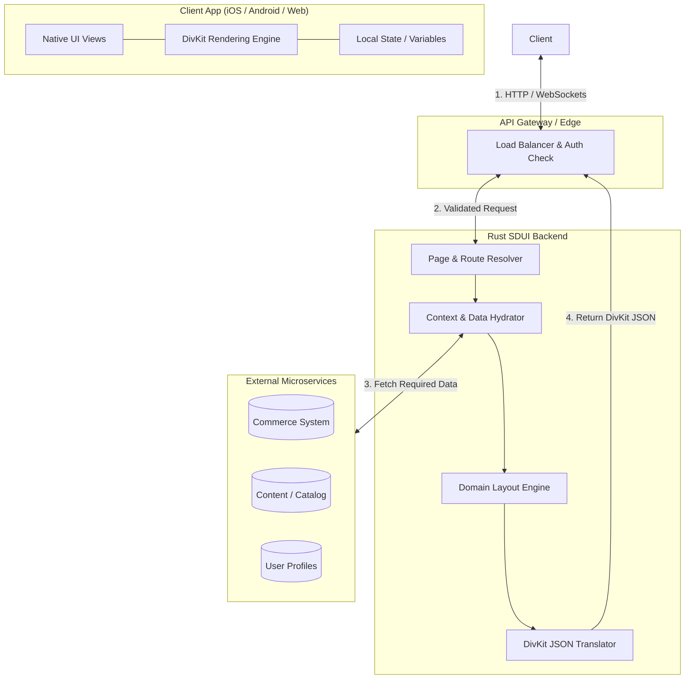

### 1.2 The Request Lifecycle Flow

When a user launches the app or taps a navigation link, the backend must resolve *who* they are, *what* page they requested, and *what data* that page needs before drawing the UI.

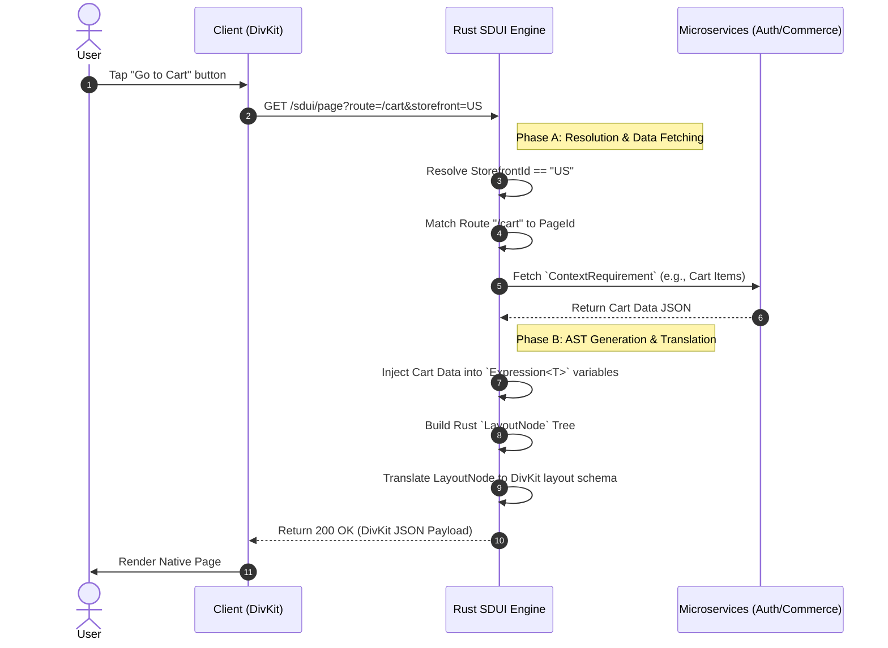

---

## Volume II: The Global Boundaries (Domain Roots)

Before we draw a single UI element on the screen, the system must set up the global environment. In DDD, these are our **Aggregate Roots**. 

### 2.1 The Storefront Context (Multi-tenancy)

A single SDUI backend can serve multiple apps, brands, or geographical regions. The `Storefront` model defines the absolute highest boundary. It manages global settings and controls the overall design language through the `ThemeTokenRegistry`.

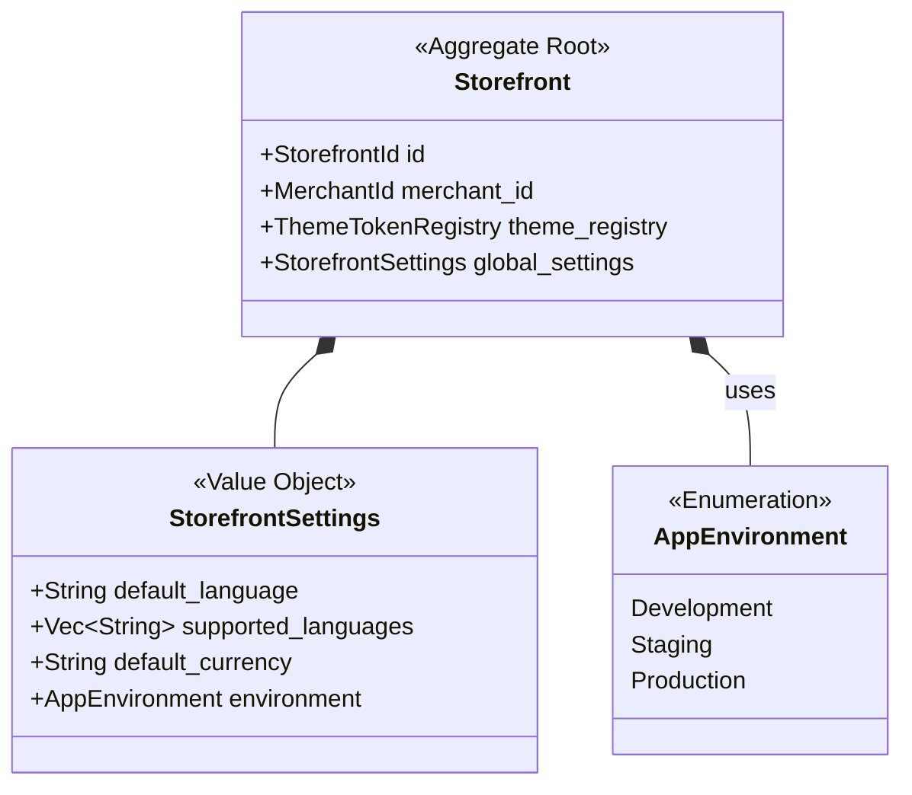

*   **Flow & Responsibility:** When an API request comes in, the API Gateway identifies the `StorefrontId` (e.g., via domain name or headers). The backend loads this exact `Storefront`. If the `AppEnvironment` is `Production`, testing widgets or draft pages are stripped from the pipeline. 

### 2.2 The Page Context (Routing & Data Hydration)

The `Page` model represents a single, navigable screen in the application. However, it's not just a collection of UI widgets. It is the controller for routing, reactive triggers, and data dependencies. 

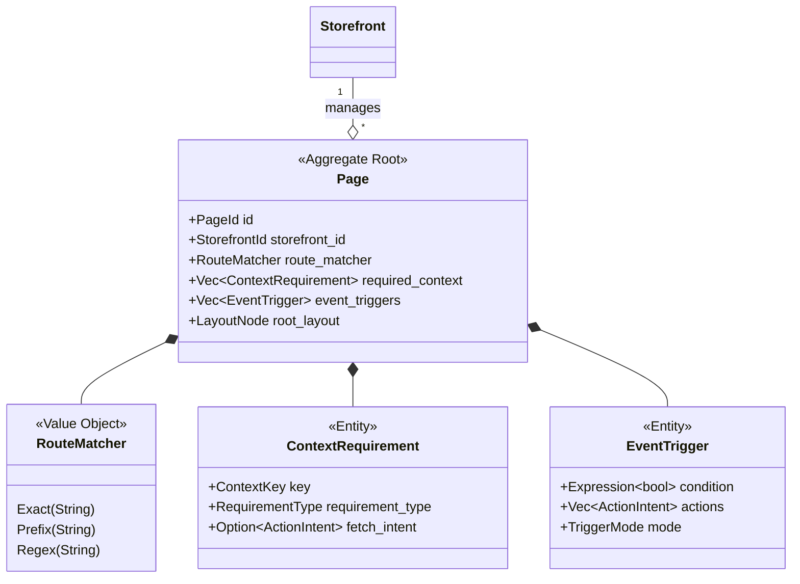

#### Detailed Sub-Flow: Context Hydration
A major product requirement is avoiding UI jank and endless loading spinners. By defining `ContextRequirement` at the `Page` level, a screen will **never** attempt to draw its UI tree (`root_layout`) until the backend has fetched the required data. 

1.  **Route Match:** User navigates to `/profile/settings`. `RouteMatcher::Prefix("/profile")` matches.
2.  **Context Fetch:** The screen lists a `ContextRequirement` for `ContextKey("user_profile")` marked as `RequirementType::Required`.
3.  **Action Intent Evaluation:** The SDUI Engine uses the provided `fetch_intent` (e.g., an internal HTTP call to the Profile Service) to resolve the data map *before* translation.
4.  **Event Triggers:** Upon successfully loading the page on the client, an `EventTrigger` configured as `TriggerMode::OnConditionMet` might automatically fire an analytics tracking event using an `ActionIntent`.

---

## Volume III: The Component Tree

Once the domain routing is finalized and data context hydrated, the backend begins to formulate the generic abstract syntax tree (AST). We call this the **Component Tree**. It serves as the "Flesh" of the layout.

### 3.1 The Unifying Wrapper: LayoutNode

In traditional systems, every widget (Image, text, button) has its own margin, padding, visibility, and size properties. In our SDUI domain, these duplicate fields are stripped out recursively and controlled by a master entity called `LayoutNode`.

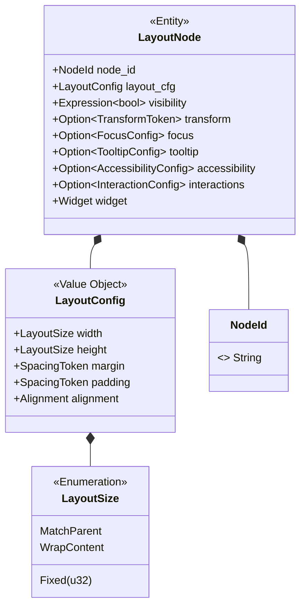

*   **DRY Layout & Rendering Engine Mapping:** This separation allows our Rust engine to apply rendering optimizations uniformly. When DivKit translates a `div-text`, it does not need to compute margins individually. It recursively processes `LayoutNode` definitions and applies padding globally, drastically reducing schema payload size.

### 3.2 The Widget AST Core (Component Implementations)

The `Widget` enum is the exhaustive container of all functional components the platform supports. It acts as the switchboard that the DivKit translation engine reads to determine the concrete JSON schema element (`div-image`, `div-input`, `div-container`).

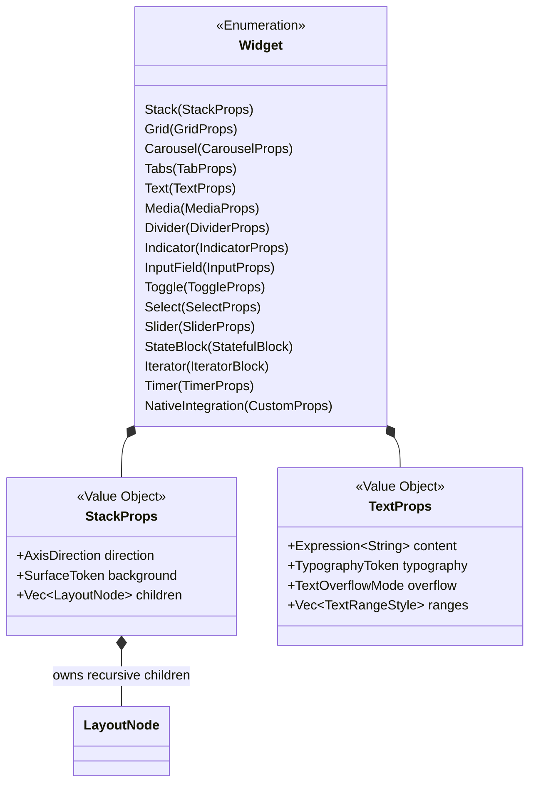

### 3.3 Dynamic Components: Iterators & State Blocks

A key value proposition of the DivKit engine is the ability to handle state and iteration on the client device without backend round-trips. We model this via specialized complex blocks.

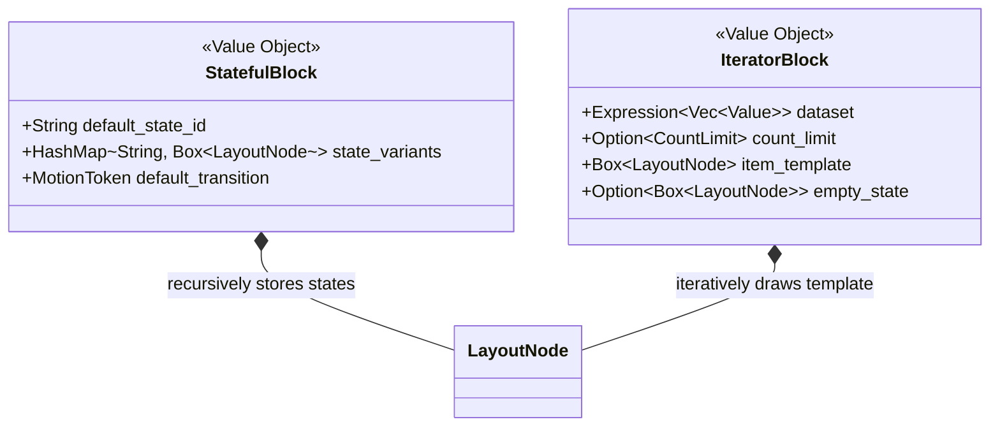

#### Detailed Sub-Flow: Iterator Expansion
1.  **Backend Definition:** The Product team defines a gallery of product cards. The SDUI backend does not loop over the products in Rust. Instead, it outputs an `IteratorBlock`.
2.  **Dataset Binding:** `IteratorBlock.dataset` is bound to `@{"context.products"}`.
3.  **Template Binding:** `item_template` is a single `LayoutNode` (a card) bound to `@{"it.price"}` and `@{"it.title"}`.
4.  **Client Execution:** The DivKit container takes the iterator schema and stamps it natively on the GPU, yielding massive performance gains.

---

## Volume IV: The Design Token System

To remain genuinely tenant-agnostic, the Rust backend is completely scrubbed of raw hexadecimal values or pixel shadow offsets. Instead, the design system utilizes a structured taxonomy of tokens.

### 4.1 Theme Token Registry & Semantic Surfaces

The `ThemeTokenRegistry` is the translation dictionary loaded by the `Storefront`.

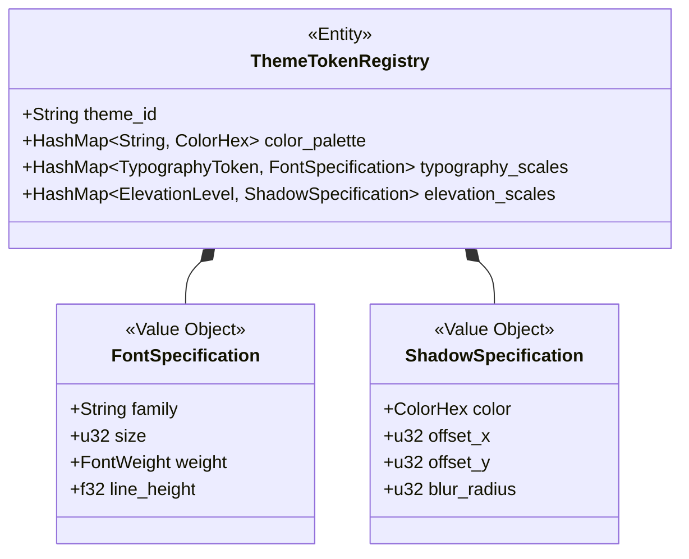

When a layout component (like a Card) requires a background, it asks for a **Surface**, never a color. The `SurfaceToken` encapsulates borders, elevation drops, and background fills as semantic intents. 

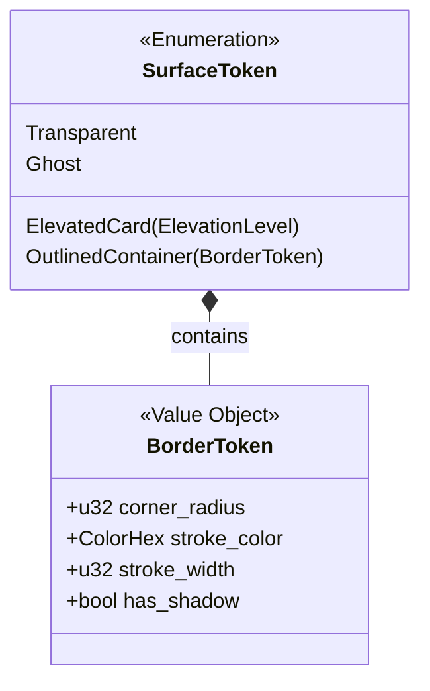

*   **Sub-Flow: Token Translation:** When `Widget::Stack(StackProps)` evaluates to DivKit, the SDUI translator runs `StackProps.background` (e.g., `ElevatedCard(Medium)`) through the `ThemeTokenRegistry` belonging to the current `Storefront`, outputting absolute DivKit JSON `{ "color": "#1F2328", "shadow_color": "#00000033" }`.

---

## Volume V: Interactivity & Business Logic

SDUI without interactivity is just a static website constraint. We utilize a powerful **Action Intent Engine** bound directly alongside our **Form Validation Engine**. This allows UI gestures to mutate state or trigger business rules remotely.

### 5.1 The Interaction Config

Interactions are tracked not on the Widget, but natively on the `LayoutNode`, allowing any abstract element to capture touches or visibility flashes.

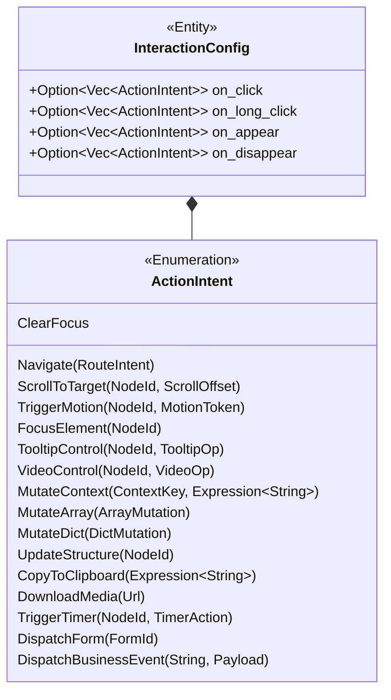

### 5.2 Array & Sub-Mutations (The Reactive Engine)

A critical component of avoiding constant API reloading is performing logical memory mutations safely. `ArrayMutation` is how the Rust backend instructs the client device to modify the `dataset` used by an `IteratorBlock`.

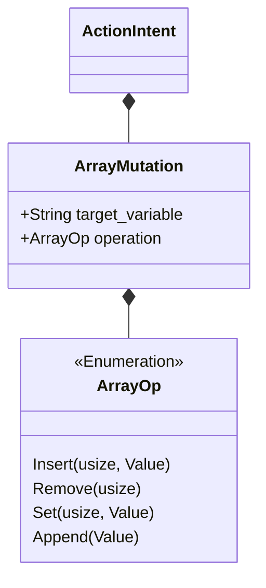

### 5.3 End-to-End Dynamic Interaction Flow

To see the system run natively, consider the sequence where a user interacts with a dynamic shopping cart powered by our DDD interactions.

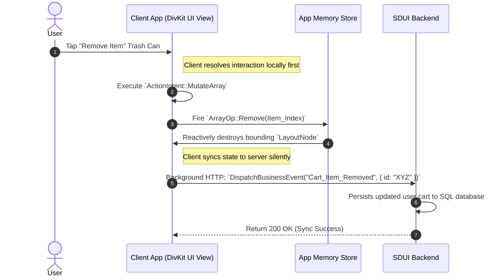

### 5.4 Form Validation & Trust

Inputs and Forms have dual-layer verification strategies natively built into `InputProps`.

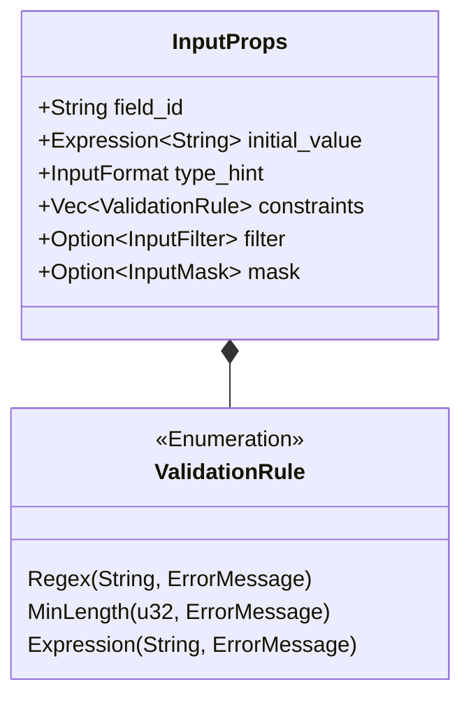

1.  **Definition Generation:** SDUI sends `Regex("^[0-9]+$", "Invalid Zip")`.
2.  **Client Typing:** User types letters. DivKit rejects input instantly based on the rules, illuminating the "Invalid Zip" string. 
3.  **Dispatch Form:** If client passes, the submit button fires `ActionIntent::DispatchForm("checkout_form")`.
4.  **Backend Re-validation:** The Rust routing engine intercepts the `DispatchForm` intent, unmarshalls the input keys, structurally verifies the exact `ValidationRule` enum array server-side to prevent network attacks, and finally processes the checkout. 

