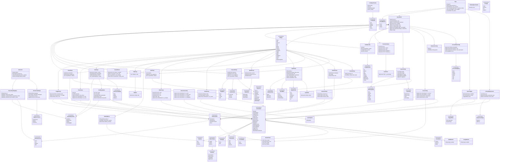

# SDUI Domain Class Diagram

```mermaid
classDiagram
  class Storefront {
    +StorefrontId id
    +MerchantId merchant_id
    +ThemeTokenRegistry theme_registry
    +StorefrontSettings global_settings
  }
  class StorefrontSettings {
    +String default_language
    +Vec~String~ supported_languages
    +String default_currency
    +AppEnvironment environment
  }
  class ThemeTokenRegistry {
    +String theme_id
    +HashMap~String color_palette
    +HashMap~TypographyToken typography_scales
    +HashMap~ElevationLevel elevation_scales
  }
  class Page {
    +PageId id
    +StorefrontId storefront_id
    +RouteMatcher route_matcher
    +Vec~ContextRequirement~ required_context
    +Vec~EventTrigger~ event_triggers
    +LayoutNode root_layout
  }
  class ContextRequirement {
    +ContextKey key
    +RequirementType requirement_type
    +Option~ActionIntent~ fetch_intent
  }
  class EventTrigger {
    +Expression~bool~ condition
    +Vec~ActionIntent~ actions
    +TriggerMode mode
  }
  class LayoutNode {
    +NodeId node_id
    +LayoutConfig layout_cfg
    +Option~TransformToken~ transform
    +Expression~bool~ visibility
    +Option~FocusConfig~ focus
    +Option~TooltipConfig~ tooltip
    +Option~AccessibilityConfig~ accessibility
    +Option~Vec~ExtensionConfig~~ extensions
    +Widget widget
  }
  class LayoutConfig {
    +LayoutSize width
    +LayoutSize height
    +SpacingToken margin
    +SpacingToken padding
    +Alignment alignment
  }
  class StackProps {
    +AxisDirection direction
    +SurfaceToken background
    +Vec~LayoutNode~ children
  }
  class GridProps {
    +u32 columns
    +Alignment cross_alignment
    +Vec~LayoutNode~ children
  }
  class CarouselProps {
    +AxisDirection direction
    +SnapMode snap_mode
    +Alignment cross_alignment
    +Vec~LayoutNode~ children
  }
  class TabProps {
    +Vec~TabItem~ tabs
  }
  class TabItem {
    +Expression~String~ title
  }
  class MediaProps {
    +Expression~Url~ source
    +Expression~String~ alt_text
    +MediaKind kind
  }
  class TextProps {
    +Expression~String~ content
    +TypographyToken typography
    +TextOverflowMode overflow
    +Vec~TextRangeStyle~ ranges
  }
  class DividerProps {
    +AxisDirection orientation
    +u32 weight
    +SurfaceToken color
  }
  class IndicatorProps {
    +String linked_carousel_id
    +SurfaceToken active_token
    +SurfaceToken inactive_token
  }
  class StatefulBlock {
    +String default_state_id
    +HashMap~String state_variants
    +MotionToken default_transition
  }
  class IteratorBlock {
    +Expression~Vec~Value~~ dataset
    +Option~CountLimit~ count_limit
    +Box~LayoutNode~ item_template
    +Option~Box~LayoutNode~~ empty_state
  }
  class TimerProps {
    +String id
    +Duration duration
    +Option~Duration~ tick_interval
    +Option~Vec~ActionIntent~~ on_tick
    +Option~Vec~ActionIntent~~ on_end
  }
  class CustomProps {
    +String extension_id
    +HashMap~String custom_data
  }
  class InputProps {
    +String field_id
    +Expression~String~ initial_value
    +InputFormat type_hint
    +Vec~ValidationRule~ constraints
    +Option~InputFilter~ filter
    +Option~InputMask~ mask
  }
  class ToggleProps {
    +Expression~bool~ checked_value
    +Option~Vec~ActionIntent~~ on_toggle
    +SurfaceToken active_color
  }
  class SelectProps {
    +Expression~String~ value
    +Vec~SelectOption~ options
    +Option~Vec~ActionIntent~~ on_select
  }
  class SliderProps {
    +Expression~f32~ value
    +Expression~f32~ min
    +Expression~f32~ max
    +Option~f32~ step
    +Option~Vec~ActionIntent~~ on_change
  }
  class SelectOption {
    +String label
  }
  class InputFilter {
    +Expression~String~ regex
  }
  class InteractionConfig {
    +Option~Vec~ActionIntent~~ on_click
    +Option~Vec~ActionIntent~~ on_long_click
    +Option~Vec~ActionIntent~~ on_appear
    +Option~Vec~ActionIntent~~ on_disappear
  }
  class ArrayMutation {
    +String target_variable
  }
  class DictMutation {
    +String target_variable
  }
  class BorderToken {
    +u32 corner_radius
    +ColorHex stroke_color
    +u32 stroke_width
    +bool has_shadow
  }
  class FontSpecification {
    +String family
    +u32 size
    +FontWeight weight
    +f32 line_height
  }
  class ShadowSpecification {
    +ColorHex color
  }
  class TextRangeStyle {
    +u32 start_index
    +u32 end_index
    +TypographyToken typography
    +SurfaceToken color
    +Option~ActionIntent~ link_intent
  }
  class FocusConfig {
    +Option~Vec~ActionIntent~~ on_focus
    +Option~Vec~ActionIntent~~ on_blur
    +Option~SurfaceToken~ background
    +Option~BorderToken~ border
  }
  class TooltipConfig {
    +String id
    +Box~LayoutNode~ content
    +TooltipPosition position
    +Duration duration
  }
  class AccessibilityConfig {
    +Expression~String~ description
    +Option~Expression~String~~ hint
    +Option~Expression~String~~ state_description
    +AccessibilityRole role
  }
  class ExtensionConfig {
    +String id
    +HashMap~String params
  }
  class TransformToken {
    +PivotPoint pivot
    +Expression~f32~ rotation
    +Expression~f32~ scale
    +Expression~f32~ translation_x
    +Expression~f32~ translation_y
  }
  class PivotPoint {
    +Expression~f32~ x_percentage
  }
  class AppEnvironment {
    <<enumeration>>
    Development
    Staging
    Production
  }
  class RouteMatcher {
    <<enumeration>>
    Exact
    Prefix
    Regex
  }
  class RequirementType {
    <<enumeration>>
    Required
    Optional
  }
  class TriggerMode {
    <<enumeration>>
    OnConditionMet
    EveryChange
  }
  class Widget {
    <<enumeration>>
    Stack
    Grid
    Carousel
    Tabs
    Text
    Media
    Divider
    Indicator
    InputField
    Toggle
    Select
    Slider
    StateBlock
    Iterator
    Timer
    NativeIntegration
  }
  class InputFormat {
    <<enumeration>>
    Text
    Email
    Password
    Number
    Phone
    Uri
  }
  class InputMask {
    <<enumeration>>
    Phone
    Currency
    Percentage
    CustomRegex
  }
  class ValidationRule {
    <<enumeration>>
    Regex
    MinLength
    Expression
  }
  class ActionIntent {
    <<enumeration>>
    Navigate
    ScrollToTarget
    TriggerMotion
    FocusElement
    ClearFocus
    TooltipControl
    VideoControl
    MutateContext
    MutateArray
    MutateDict
    UpdateStructure
    CopyToClipboard
    DownloadMedia
    TriggerTimer
    DispatchForm
    DispatchBusinessEvent
  }
  class RouteIntent {
    <<enumeration>>
    Internal
    External
    Modal
  }
  class ScrollOffset {
    <<enumeration>>
    Exact
    Relative
  }
  class TooltipOp {
    <<enumeration>>
    Show
    Hide
  }
  class VideoOp {
    <<enumeration>>
    Play
    Pause
    Resume
  }
  class TimerAction {
    <<enumeration>>
    Start
    Stop
    Reset
    Resume
  }
  class ArrayOp {
    <<enumeration>>
    Insert
    Remove
    Set
    Append
  }
  class LayoutSize {
    <<enumeration>>
    MatchParent
    WrapContent
    Fixed
    Percentage
  }
  class SpacingToken {
    <<enumeration>>
    None
    XSmall
    Small
    Medium
    Large
    XLarge
    Custom
  }
  class Alignment {
    <<enumeration>>
    TopLeft
    TopCenter
    TopRight
    CenterLeft
    Center
    CenterRight
    BottomLeft
    BottomCenter
    BottomRight
  }
  class AxisDirection {
    <<enumeration>>
    Horizontal
    Vertical
    Overlap
  }
  class SurfaceToken {
    <<enumeration>>
    Transparent
    ElevatedCard
    OutlinedContainer
    Ghost
  }
  class TypographyToken {
    <<enumeration>>
    Headline1
    BodyPrimary
    Caption
    PriceHighlight
  }
  class FontWeight {
    <<enumeration>>
    Light
    Regular
    Medium
    Bold
    Heavy
  }
  class ElevationLevel {
    <<enumeration>>
    None
    Low
    Medium
    High
  }
  class MediaKind {
    <<enumeration>>
    StaticImage
    AnimatedGif
    VideoPlaylist
  }
  class TextOverflowMode {
    <<enumeration>>
    Wrap
    Ellipsis
    Truncate
    Marquee
  }
  class TooltipPosition {
    <<enumeration>>
    Top
    Bottom
    Left
    Right
    TopLeft
    TopRight
    BottomLeft
    BottomRight
    Center
  }
  class AccessibilityRole {
    <<enumeration>>
    None
    Button
    Header
    Image
    Text
    Link
    Tab
  }
  class Direction {
    <<enumeration>>
    TopToBottom
    BottomToTop
    LeftToRight
    RightToLeft
  }
  class SnapMode {
    <<enumeration>>
    None
    Start
    Center
    End
  }
  class MotionToken {
    <<enumeration>>
    FadeIn
    SlideIn
    Bounce
  }
  AccessibilityConfig --> AccessibilityRole
  ActionIntent --> ArrayMutation
  ActionIntent --> DictMutation
  ActionIntent --> MotionToken
  ActionIntent --> RouteIntent
  ActionIntent --> ScrollOffset
  ActionIntent --> TimerAction
  ActionIntent --> TooltipOp
  ActionIntent --> VideoOp
  CarouselProps --> Alignment
  CarouselProps --> AxisDirection
  CarouselProps --> LayoutNode
  CarouselProps --> SnapMode
  ContextRequirement --> ActionIntent
  ContextRequirement --> RequirementType
  DividerProps --> AxisDirection
  DividerProps --> SurfaceToken
  EventTrigger --> ActionIntent
  EventTrigger --> TriggerMode
  FocusConfig --> ActionIntent
  FocusConfig --> BorderToken
  FocusConfig --> SurfaceToken
  FontSpecification --> FontWeight
  GridProps --> Alignment
  GridProps --> LayoutNode
  IndicatorProps --> SurfaceToken
  InputProps --> InputFilter
  InputProps --> InputFormat
  InputProps --> InputMask
  InputProps --> ValidationRule
  InteractionConfig --> ActionIntent
  IteratorBlock --> LayoutNode
  LayoutConfig --> Alignment
  LayoutConfig --> LayoutSize
  LayoutConfig --> SpacingToken
  LayoutNode --> AccessibilityConfig
  LayoutNode --> ExtensionConfig
  LayoutNode --> FocusConfig
  LayoutNode --> LayoutConfig
  LayoutNode --> TooltipConfig
  LayoutNode --> TransformToken
  LayoutNode --> Widget
  MediaProps --> MediaKind
  MotionToken --> Direction
  Page --> ContextRequirement
  Page --> EventTrigger
  Page --> LayoutNode
  Page --> RouteMatcher
  SelectProps --> ActionIntent
  SelectProps --> SelectOption
  SliderProps --> ActionIntent
  StackProps --> AxisDirection
  StackProps --> LayoutNode
  StackProps --> SurfaceToken
  StatefulBlock --> MotionToken
  Storefront --> StorefrontSettings
  Storefront --> ThemeTokenRegistry
  StorefrontSettings --> AppEnvironment
  SurfaceToken --> BorderToken
  SurfaceToken --> ElevationLevel
  TabProps --> TabItem
  TextProps --> TextOverflowMode
  TextProps --> TextRangeStyle
  TextProps --> TypographyToken
  TextRangeStyle --> ActionIntent
  TextRangeStyle --> SurfaceToken
  TextRangeStyle --> TypographyToken
  ThemeTokenRegistry --> ElevationLevel
  ThemeTokenRegistry --> TypographyToken
  TimerProps --> ActionIntent
  ToggleProps --> ActionIntent
  ToggleProps --> SurfaceToken
  TooltipConfig --> LayoutNode
  TooltipConfig --> TooltipPosition
  TransformToken --> PivotPoint
  Widget --> CarouselProps
  Widget --> CustomProps
  Widget --> DividerProps
  Widget --> GridProps
  Widget --> IndicatorProps
  Widget --> InputProps
  Widget --> IteratorBlock
  Widget --> MediaProps
  Widget --> SelectProps
  Widget --> SliderProps
  Widget --> StackProps
  Widget --> StatefulBlock
  Widget --> TabProps
  Widget --> TextProps
  Widget --> TimerProps
  Widget --> ToggleProps
```
