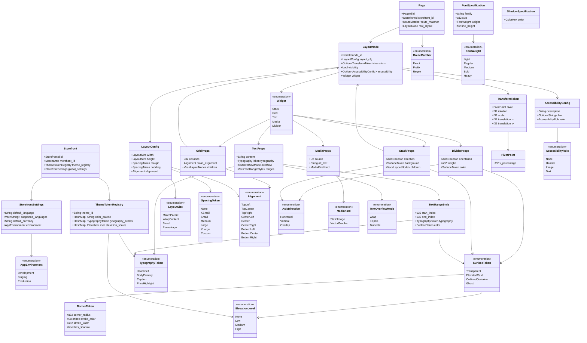

# SDUI Domain Class Diagram

```mermaid
classDiagram
  class Storefront {
    +StorefrontId id
    +MerchantId merchant_id
    +ThemeTokenRegistry theme_registry
    +StorefrontSettings global_settings
  }
  class StorefrontSettings {
    +String default_language
    +Vec~String~ supported_languages
    +String default_currency
    +AppEnvironment environment
  }
  class ThemeTokenRegistry {
    +String theme_id
    +HashMap~String color_palette
    +HashMap~TypographyToken typography_scales
    +HashMap~ElevationLevel elevation_scales
  }
  class Page {
    +PageId id
    +StorefrontId storefront_id
    +RouteMatcher route_matcher
    +LayoutNode root_layout
  }
  class LayoutNode {
    +NodeId node_id
    +LayoutConfig layout_cfg
    +Option~TransformToken~ transform
    +bool visibility
    +Option~AccessibilityConfig~ accessibility
    +Widget widget
  }
  class LayoutConfig {
    +LayoutSize width
    +LayoutSize height
    +SpacingToken margin
    +SpacingToken padding
    +Alignment alignment
  }
  class StackProps {
    +AxisDirection direction
    +SurfaceToken background
    +Vec~LayoutNode~ children
  }
  class GridProps {
    +u32 columns
    +Alignment cross_alignment
    +Vec~LayoutNode~ children
  }
  class MediaProps {
    +Url source
    +String alt_text
    +MediaKind kind
  }
  class TextProps {
    +String content
    +TypographyToken typography
    +TextOverflowMode overflow
    +Vec~TextRangeStyle~ ranges
  }
  class DividerProps {
    +AxisDirection orientation
    +u32 weight
    +SurfaceToken color
  }
  class BorderToken {
    +u32 corner_radius
    +ColorHex stroke_color
    +u32 stroke_width
    +bool has_shadow
  }
  class FontSpecification {
    +String family
    +u32 size
    +FontWeight weight
    +f32 line_height
  }
  class ShadowSpecification {
    +ColorHex color
  }
  class TextRangeStyle {
    +u32 start_index
    +u32 end_index
    +TypographyToken typography
    +SurfaceToken color
  }
  class AccessibilityConfig {
    +String description
    +Option~String~ hint
    +AccessibilityRole role
  }
  class TransformToken {
    +PivotPoint pivot
    +f32 rotation
    +f32 scale
    +f32 translation_x
    +f32 translation_y
  }
  class PivotPoint {
    +f32 x_percentage
  }
  class AppEnvironment {
    <<enumeration>>
    Development
    Staging
    Production
  }
  class RouteMatcher {
    <<enumeration>>
    Exact
    Prefix
    Regex
  }
  class Widget {
    <<enumeration>>
    Stack
    Grid
    Text
    Media
    Divider
  }
  class LayoutSize {
    <<enumeration>>
    MatchParent
    WrapContent
    Fixed
    Percentage
  }
  class SpacingToken {
    <<enumeration>>
    None
    XSmall
    Small
    Medium
    Large
    XLarge
    Custom
  }
  class Alignment {
    <<enumeration>>
    TopLeft
    TopCenter
    TopRight
    CenterLeft
    Center
    CenterRight
    BottomLeft
    BottomCenter
    BottomRight
  }
  class AxisDirection {
    <<enumeration>>
    Horizontal
    Vertical
    Overlap
  }
  class SurfaceToken {
    <<enumeration>>
    Transparent
    ElevatedCard
    OutlinedContainer
    Ghost
  }
  class TypographyToken {
    <<enumeration>>
    Headline1
    BodyPrimary
    Caption
    PriceHighlight
  }
  class FontWeight {
    <<enumeration>>
    Light
    Regular
    Medium
    Bold
    Heavy
  }
  class ElevationLevel {
    <<enumeration>>
    None
    Low
    Medium
    High
  }
  class MediaKind {
    <<enumeration>>
    StaticImage
    VectorGraphic
  }
  class TextOverflowMode {
    <<enumeration>>
    Wrap
    Ellipsis
    Truncate
  }
  class AccessibilityRole {
    <<enumeration>>
    None
    Header
    Image
    Text
  }
  AccessibilityConfig --> AccessibilityRole
  DividerProps --> AxisDirection
  DividerProps --> SurfaceToken
  FontSpecification --> FontWeight
  GridProps --> Alignment
  GridProps --> LayoutNode
  LayoutConfig --> Alignment
  LayoutConfig --> LayoutSize
  LayoutConfig --> SpacingToken
  LayoutNode --> AccessibilityConfig
  LayoutNode --> LayoutConfig
  LayoutNode --> TransformToken
  LayoutNode --> Widget
  MediaProps --> MediaKind
  Page --> LayoutNode
  Page --> RouteMatcher
  StackProps --> AxisDirection
  StackProps --> LayoutNode
  StackProps --> SurfaceToken
  Storefront --> StorefrontSettings
  Storefront --> ThemeTokenRegistry
  StorefrontSettings --> AppEnvironment
  SurfaceToken --> BorderToken
  SurfaceToken --> ElevationLevel
  TextProps --> TextOverflowMode
  TextProps --> TextRangeStyle
  TextProps --> TypographyToken
  TextRangeStyle --> SurfaceToken
  TextRangeStyle --> TypographyToken
  ThemeTokenRegistry --> ElevationLevel
  ThemeTokenRegistry --> TypographyToken
  TransformToken --> PivotPoint
  Widget --> DividerProps
  Widget --> GridProps
  Widget --> MediaProps
  Widget --> StackProps
  Widget --> TextProps
```
